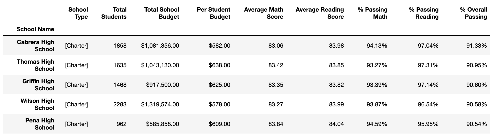

# pandas-challenge
 GT Data Bootcamp - Pandas HW_Rios

## PyCitySchools

City's school district analysis of math and reading testing scores. 

## Overall Trends
Overall Trends in school performance:

* DISTRICTWIDE:
    * On average, students out performed in reading over math. 85.81% passed reading with a score of 70 or 
    higher, while 74.98% passed math with a score of 70 or higher (see District Summary table).
* SCHOOL TYPE: 
    * All charter schools out performed all district schools in both math and reading % passing with a 
    70 or higher (see Scores by School Type table).  
* SCHOOL SIZE:
    * Top 5 performing schools are all charter schools with less than 2300 students.  Bottom 5 performing 
    schools are all district schools with more than 2300 students.  So small to medium (<2000) schools out 
    performed larger schools (2000-5000) (see Top and Bottom Performing Schools tables).
* GRADE LEVEL: 
    * Students scored similarly in 9th, 10th, 11th, and 12th in both math and reading, grade level does 
    not appear to impact testing score (see Math and Reading Scores by Grade tables).
* PER STUDENT BUDGET:
    * Spending per student and test scores do not appear to correlate.  
    * Schools that had a lower per student budget (<$585 per student) had a higher overall passing rate in 
    both math and reading.  Whereas, schools with a higher per student budget ($645-$655) had a lower 
    overall passing rate in both math and reading (see Scores by School Spending table)

## Final Report: See Descriptions and Tables

### District Summary

* Snapshot of the district's key metrics, including:
  * Total Schools
  * Total Students
  * Total Budget
  * Average Math Score
  * Average Reading Score
  * % Passing Math (The percentage of students that passed math.)
  * % Passing Reading (The percentage of students that passed reading.)
  * % Overall Passing (The percentage of students that passed math **and** reading.)
  

 

### School Summary

* Overview table that summarizes key metrics about each school.

### Top Performing Schools (By % Overall Passing)

* Table that highlights the top 5 performing schools based on % Overall Passing.

### Bottom Performing Schools (By % Overall Passing)

* Bottom 5 performing schools based on % Overall Passing. Include all of the same metrics as above.

### Math Scores by Grade

* Average Math Score for students of each grade level (9th, 10th, 11th, 12th) at each school.

### Reading Scores by Grade

* Average Reading Score for students of each grade level (9th, 10th, 11th, 12th) at each school.

### Scores by School Spending

* School performances based on average Spending Ranges (Per Student)

### Scores by School Size

* School performances based on School Size

### Scores by School Type

* School performances based on School Type: District or Charter

